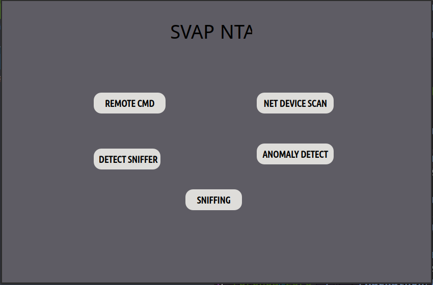
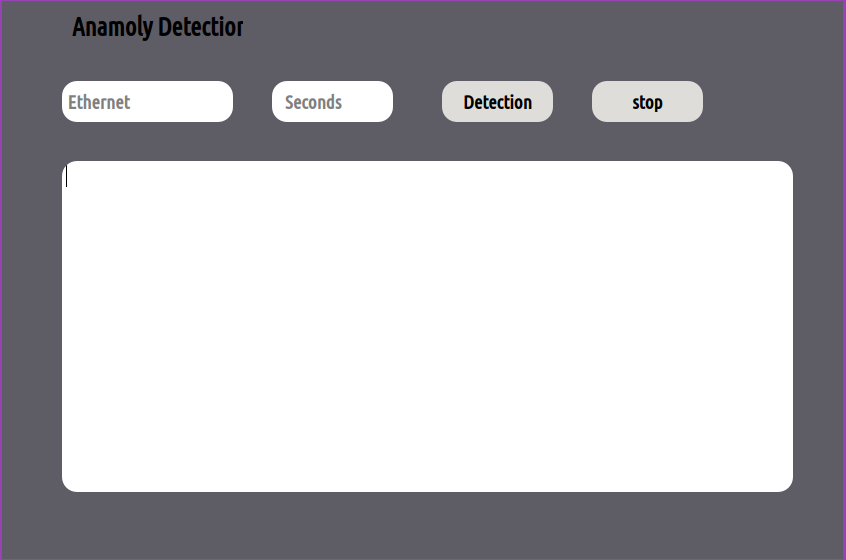
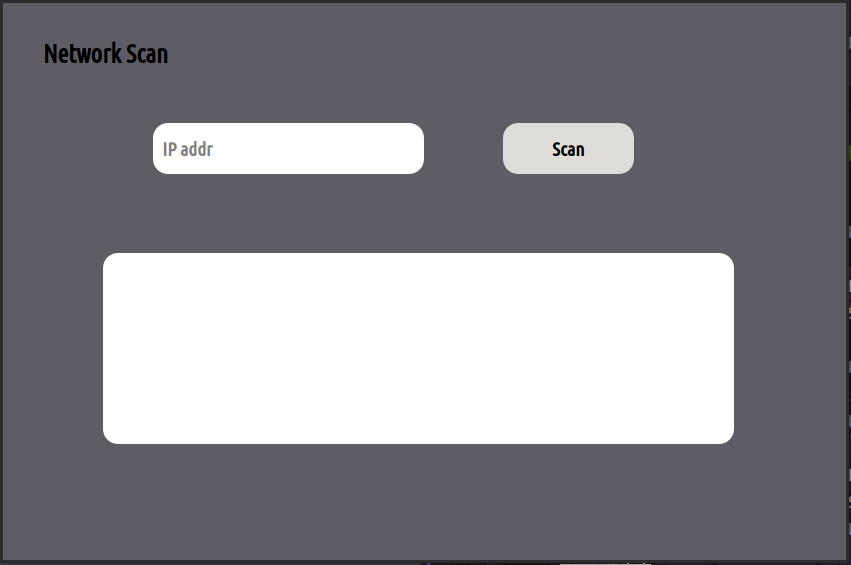
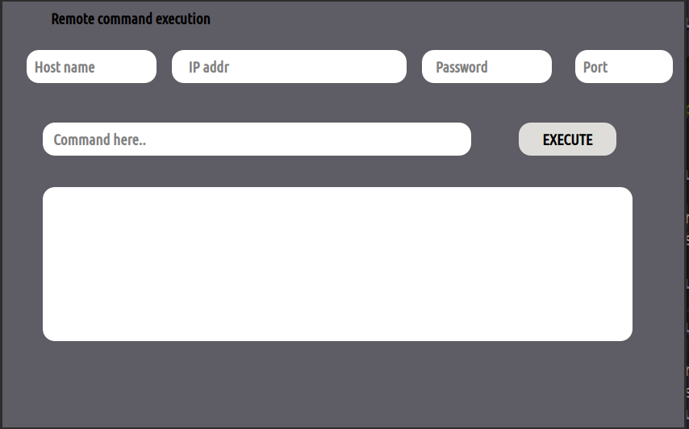
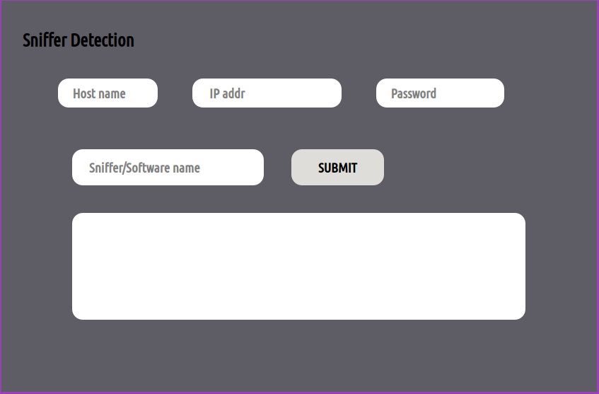

# Network Sec

This was the project based on detection of malicious activity in the network. Using the python and its GUI packages.

## :cookie: Requirments 
- Python3
- PyQt5

***Open Source tool***
- nmap
- snort

***Admin host***
- This was executed in Ubuntu 21.04

## :orange_book: Application Functionality 
**REMOTE CMD**
- This allows admin to remote command line execution and get the output
**NET DEVICE SCAN**
- To scan the entire network to check the number of device active
**DETECT SNIFFER**
- This was a major one where allows admin to check if there is any host running any perticular sniffer like wireshark or tcpdump and etc
**ANOMALY DETECT**
- Using the snort integration this sections detects the malicious activity in the network
**SNIFF**
- This is basically for monitoring the newtrok

## Output
**Home**

**AnamolyDetection**

**Network Scan**

**Remote Command execution**

**network Monitoring**

**Sniffer detection**

**Contributor**

